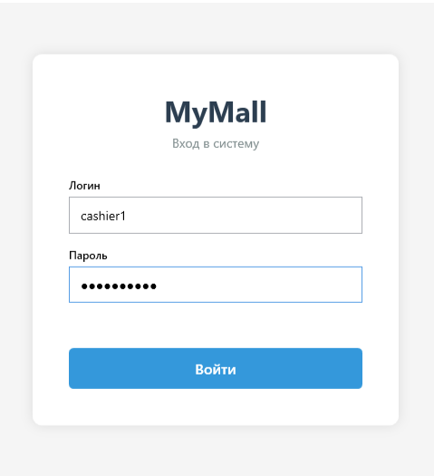
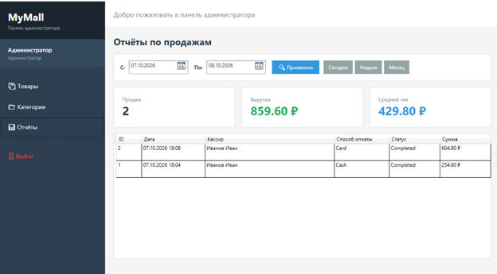
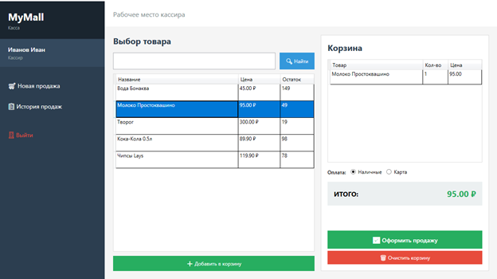

# MyMall — Автоматизация офлайн-магазина

WPF-приложение для автоматизации розничного магазина: учёт товаров, категорий, продаж и отчёты.  
Построено на **.NET 8**, **WPF**, **MVVM**, **Entity Framework Core** и **PostgreSQL**.

---

## 🚀 Возможности

### 👨‍💼 Администратор
- Управление товарами (CRUD)
- Управление категориями (CRUD)
- Поиск товаров по названию и штрихкоду
- Отчёты по продажам (за день, неделю, месяц, произвольный период)
- Статистика: количество продаж, выручка, средний чек

### 💰 Кассир
- Оформление продаж (корзина, выбор способа оплаты)
- Списание товара со склада
- История своих продаж
- Поиск товаров

---

## 🛠️ Технологии

| Слой | Технология |
|---|---|
| UI | WPF (.NET 8) |
| Архитектура | MVVM (CommunityToolkit.Mvvm) |
| ORM | Entity Framework Core 8 |
| БД | PostgreSQL (Npgsql) |
| DI | Microsoft.Extensions.DependencyInjection |
| Логирование | (планируется Serilog) |

---

## 🏗️ Архитектура

```
MyMall/
├── Common/           — базовые классы, хелперы, конвертеры
├── Data/             — DbContext, конфигурации, репозитории
├── Entities/         — сущности БД
├── Enums/            — перечисления
├── Services/         — бизнес-логика, DTOs
├── ViewModels/       — ViewModels (MVVM)
│   ├── Admin/        — ViewModels админа
│   ├── Cashier/      — ViewModels кассира
│   └── Base/         — базовый ViewModel
└── Views/            — XAML (окна и UserControls)
    ├── Admin/
    └── Cashier/
```

### Слои

- **Entities** — доменные модели (User, Product, Category, Sale, SaleItem)
- **Data** — работа с БД через EF Core (DbContext, репозитории)
- **Services** — бизнес-логика, валидация, DTOs
- **ViewModels** — состояние UI, команды
- **Views** — XAML-разметка

---

## 🗄️ Схема БД

| Таблица | Описание |
|---|---|
| `users` | Персонал (админы, кассиры) |
| `categories` | Категории товаров |
| `products` | Товары |
| `sales` | Продажи |
| `sale_items` | Позиции продаж |

### Связи

- `Category 1 → * Product`
- `Product 1 → * SaleItem`
- `Sale 1 → * SaleItem`
- `User 1 → * Sale`

---

## 🚦 Запуск

### 1. Требования

- [.NET 8 SDK](https://dotnet.microsoft.com/download/dotnet/8.0)
- [PostgreSQL 15+](https://www.postgresql.org/download/)
- Visual Studio 2022 или JetBrains Rider

### 2. Настройка БД

Создай базу данных:

```sql
CREATE DATABASE shop_automation;
```

### 3. Настройка подключения

В `MyMall/appsettings.json` укажи строку подключения:

```json
{
  "ConnectionStrings": {
    "DefaultConnection": "Host=localhost;Port=5432;Database=shop_automation;Username=postgres;Password=ТВОЙ_ПАРОЛЬ"
  }
}
```

### 4. Миграции

```bash
cd MyMall
dotnet ef database update
```

### 5. Создание пользователей

Сгенерируй хеш пароля (временно в `App.xaml.cs`):

```csharp
var hash = MyMall.Common.PasswordHasher.Hash("admin123");
System.Diagnostics.Debug.WriteLine(hash);
```

Вставь в БД:

```sql
INSERT INTO users (full_name, login, password_hash, role, phone_number, email, hire_date, is_active, created_at, updated_at)
VALUES 
    ('Администратор', 'admin', 'ТВОЙ_ХЕШ', 'Admin', '+79990000001', 'admin@shop.local', NOW(), TRUE, NOW(), NOW()),
    ('Иванов Иван', 'cashier1', 'ТВОЙ_ХЕШ', 'Cashier', '+79990000002', 'cashier1@shop.local', NOW(), TRUE, NOW(), NOW());
```

### 6. Запуск

```bash
dotnet run --project MyMall
```

Или **F5** в Visual Studio.

**Данные для входа:**

- Админ: `admin` / `admin123`
- Кассир: `cashier1` / `cashier123`

---

## 📸 Скриншоты

### Окно входа


### Панель администратора — отчёты


### Касса — оформление продажи


---

## 🎯 Что реализовано

- [x] Clean Architecture (Entities / Data / Services / ViewModels / Views)
- [x] MVVM (CommunityToolkit.Mvvm)
- [x] EF Core + PostgreSQL
- [x] Dependency Injection
- [x] Аутентификация с BCrypt
- [x] Роли (Admin / Cashier)
- [x] CRUD товаров и категорий
- [x] Оформление продаж
- [x] Отчёты за период
- [x] Поиск товаров
- [ ] Логирование (Serilog) — в планах
- [ ] Unit-тесты — в планах

---

## 📄 Лицензия

MIT

---

## 👤 Автор

**Александр М**

- GitHub: [@HRgit11](https://github.com/HRgit11)
- Email: sashatscrew312@gmail.com